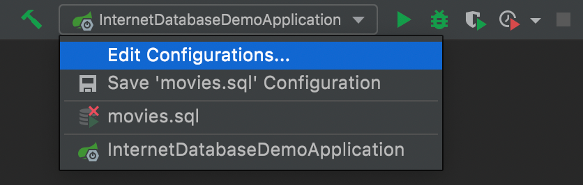
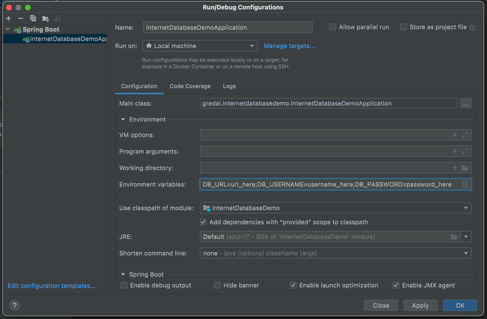
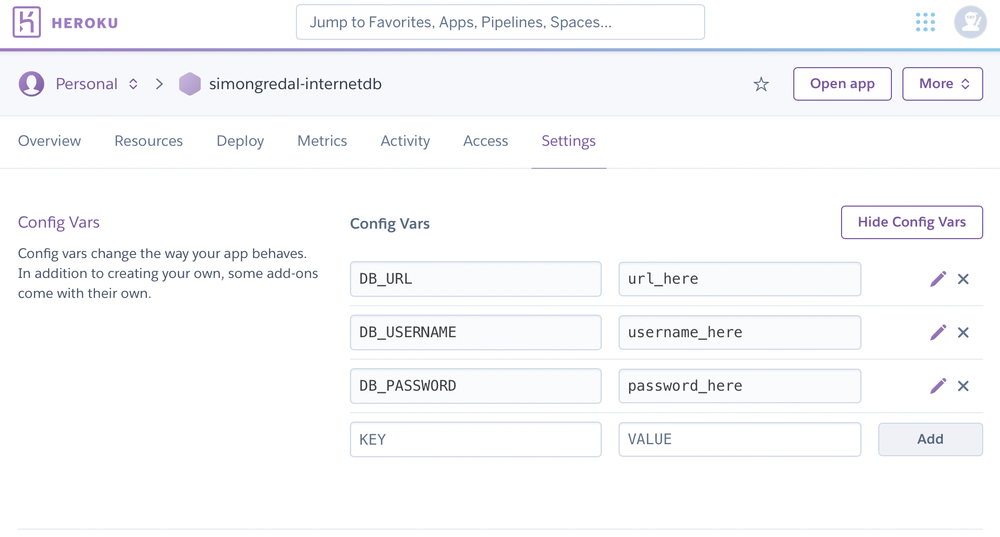

# Environment Variables Guide

You should not enter your sensitive credentials in the `application.properties` file.
Instead it should look something like this.

```properties
username=${DB_URL}
username=${DB_USERNAME}
password=${DB_PASSWORD}
```

Now Java will look for these three *environment variables* when it tries to read the properties.
So how do we set up these variables?

## IntelliJ IDEA

Edit your build-and-run configurations


Then add the environment variables


## Heroku

Go to the Settings tab of your Heroku app and add them
